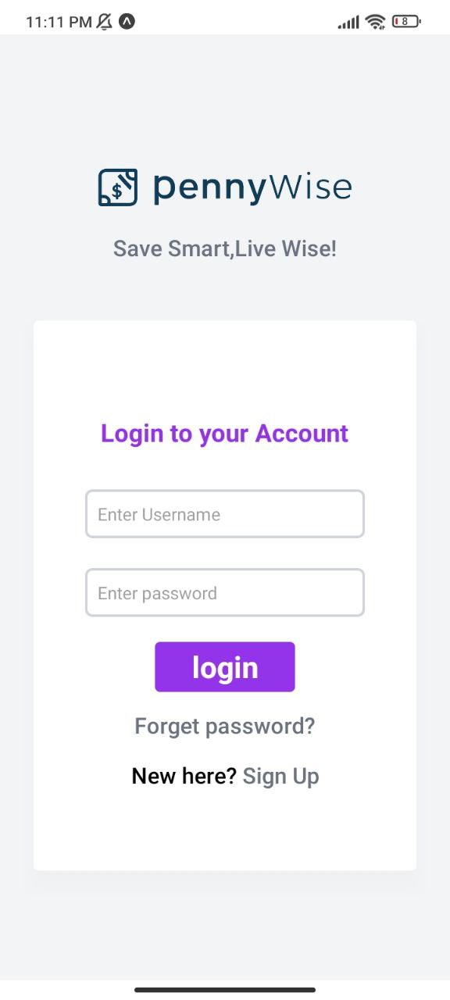

# Pennywise - Personal Finance Management App

A modern mobile application built with React Native and Expo for managing personal finances, expenses, and budgeting.

## Features

### 1. Navigation & Interface
- Bottom tab navigation with 5 main sections:
  - Wallet (Home)
  - Reports
  - Add Transaction (with custom floating action button)
  - Plans
  - Account
- Custom styled navigation bar with gradient effects
- Responsive and modern UI design
- Custom tab bar with centered floating action button

### 2. Technology Stack
- **Framework**: React Native with Expo
- **Navigation**: Expo Router (drawer and tab navigation)
- **Styling**: 
  - TailwindCSS for utility-first styling
  - Native StyleSheet for custom components
- **UI Components**:
  - Custom tab bar with floating action button
  - Responsive image icons with tint color effects
  - Custom gradient backgrounds

### 3. Project Structure
```
app/
├── (drawer)/
│   └── (tabs)/
│       ├── _layout.tsx      # Tab navigation configuration
│       ├── index.tsx        # Wallet screen
│       ├── two.tsx          # Reports screen
│       ├── addTransaction/  # Transaction screen
│       ├── plans/          # Planning screen
│       └── account/        # Account screen
components/
└── utils/
    └── constants.ts       # App-wide constants and assets
```

## Setup Instructions

1. **Prerequisites**
   ```bash
   # Install Node.js and npm/yarn
   npm install -g expo-cli
   ```

2. **Installation**
   ```bash
   # Clone the repository
   git clone [repository-url]
   cd Pennywise_native_mobileAPP

   # Install dependencies
   npm install
   # or
   yarn install
   ```

3. **Running the App**
   ```bash
   npx expo start
   ```

## Dependencies
- expo
- expo-router
- react-native
- expo-linear-gradient
- react-native-gesture-handler
- react-native-reanimated
- react-native-safe-area-context
- react-native-screens

## Development
- TypeScript for type safety
- Modern React patterns and hooks
- Responsive design principles
- Custom components for reusability

## Contributing
Feel free to submit issues and enhancement requests.

## License
[Your chosen license]

## Screenshots

<div style="display: flex; flex-wrap: wrap; gap: 10px; justify-content: center;">
  
  
  
  
</div>

